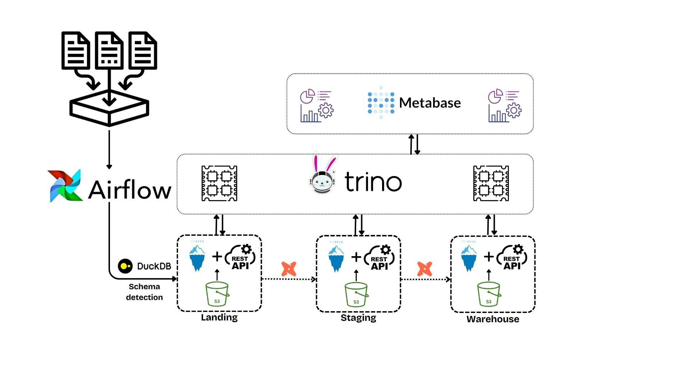

# Opensource data lakehouse

This repository contains the code for the opensource data lakehouse project. The goal of this project is to provide a simple and easy to use data lakehouse solution that can be used by anyone.

## Architecture



The project uses the following technologies:

- **Apache Iceberg with REST API**: A high-performance table format for huge analytic datasets.
- **Trino**: A modern distributed query engine on top of Iceberg for querying data.
- **Metabase**: For data exploration and visualization.
- **dbt**: Tool for transforming data.
- **Airflow**: A platform to programmatically schedule and monitor workflows.
- **DuckDB**: For reading files and automatic schema detection.

## How to run
1. Clone the repository:
   ```bash
   git clone git@github.com:shanazar/data_lakehouse.git
    ```
2. Create an S3 bucket (it's pretty cheap). 
3. Replace S3 variables in the following files:
   - `docker-compose.yml` in the `data_lakehouse` directory.
   - `*.properties` files in the `data_lakehouse/trino/catalog` directory.
   - `configuration.yaml` in the `airflow/include` directory.
4. Run Iceberg REST + Trino by navigating to the `data_lakehouse` directory and running:
   ```bash
   docker-compose up -d
   ```
5. Add Trino profile to dbt as shown in the dbt project.
6. Run Airflow by installing [astronomer](https://www.astronomer.io/docs/astro/cli/install-cli/) and navigating to the `airflow` directory and running:
   ```bash
   astro dev start
   ```
7. Run Metabase by navigating to the `metabase` directory and running:
   ```bash
   docker-compose up -d
   ```
